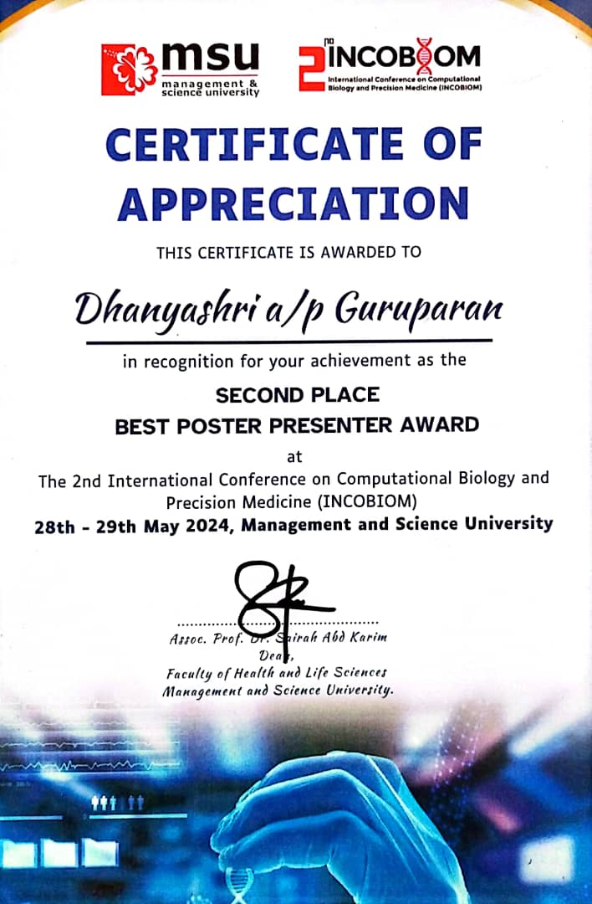
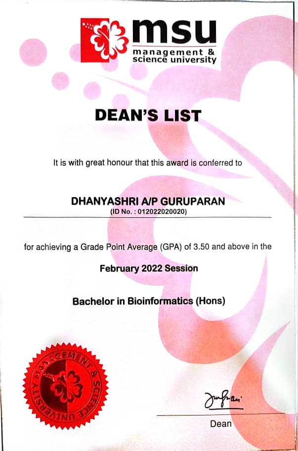

  

  

--------------------------------------------------------------------------------------------------------------------

---
# 🧰 Technical & Soft Skills

## 🧪 Bioinformatics Skills
              

## 🧠 Health Informatics & Technical Skills
                

## 💼 Soft Skills
                 

---
# 🧰 Software & Tools

## 🖥️ Bioinformatics Software & Tools

                                                                                                            

## 🖥️ Other Software & Tools

---
# 💻 Programming Languages

      

---
# 📄 Publications

### 🧪 **Comprehensive Insights into Monkeypox (mpox): Recent Advances in Epidemiology, Diagnostic Approaches and Therapeutic Strategies**

**Summary:** A comprehensive review of *Monkeypox (mpox)* covering recent breakthroughs in **epidemiology**, **diagnostic strategies**, and **emerging therapeutics**. This work contributes to better preparedness and global surveillance.

📎 [`DOI: 10.3390/pathogens14010001`](https://doi.org/10.3390/pathogens14010001)
  ━━━━━━━━━━━━━━━━━━━━━━━━━━━━━━━━━━━━━━━━━━━━━━━━━━━━━━━━━━

### 🧬 **Long COVID: G Protein-Coupled Receptors (GPCRs) Associated Genes and Pathways as a Promising Therapeutic Potential Through Computational Analysis**

**Summary:** Explores the involvement of **GPCRs** in *Long COVID* pathophysiology using **in silico transcriptomic and pathway enrichment analyses**. Highlights new therapeutic angles and drug repositioning opportunities.

 📎 [`DOI: 10.20944/preprints202408.0558.v1`](https://doi.org/10.20944/preprints202408.0558.v1)
  ━━━━━━━━━━━━━━━━━━━━━━━━━━━━━━━━━━━━━━━━━━━━━━━━━━━━━━━━━━

### 🤖 **Deep Learning in Computational Biology: Advancements, Challenges, and Future Outlook**

**Summary:** A visionary overview of how **deep learning** is revolutionizing *computational biology* — from **structure prediction** and **functional annotation** to **drug discovery**. Tackles the real-world challenges and future research horizons.

 📎 [`DOI: 10.48550/arXiv.2310.03086`](https://doi.org/10.48550/arXiv.2310.03086)

---
# 🧬 Academic Research Projects

| 🔬 **Monkeypox Protein Structure** | 💉 **Vaccine Design (Monkeypox)** | 🧪 **Rheumatoid Arthritis Analysis** |
|----------------------------------|----------------------------------|-------------------------------------|
| **Tools:** UniProt, PubChem, IGEMDOCK   **Focus:** 🧬 Molecular Docking       | **Tools:** Uniprot, VaxiJen, B/T-cell, Ifnepitope, PatchDock   **Focus:** 💉 Epitope-Based Vaccine       | **Tools:** GEO2R, Functional Enrichment, PPI Network, Cytoscape   **Focus:** 🔍 Hub Gene Detection       |

| 🧠 **Pathology System Design** | 🦠 **Novel Drug Target – *H. pylori*** | 💊 **COVID-19 Drug Analysis** |
|-------------------------------|-------------------------------|-------------------------------|
| ⚙️ Informatics system design    **Focus:** 💾 Data Architecture       | **Tools:** European Galaxy, KEGG, PSORTb, PBIT, KASS    **Focus:** Antimicrobial Resistance Bacteria *H. pylori*        |  **Tools:** SMACC, Digep-Pred, CTD, SwissADME, Enrichr, Cytoscape    **Focus:** 🔬 Systems biology + cheminformatics       |

---  
# 🏆 Achievements

| Achievement | Certificate |
|-------------|-------------|
| 🥇 Best Poster Presenter   📍 *INCOBIOM 2024*   🏅 Best Poster Award   💡 Presented award-winning research in computational biology and precision medicine. |  |
| 🎓 Dean’s List Award   🏫 *University Academic Excellence*   📅 2022, 2023, 2024   🏅 Maintained consistent academic excellence across 3 years. |  |

---
# 🧬 Scientific Participation

| **🌐 INCOBIOM 2024** *International Conference on Computational Biology & Precision Medicine* 📅 `2024` 🧬 Participated in bioinformatics & precision medicine. | **🧪 iMPaCHS 2024** *Medical, Pharmaceutical, Cosmeceutical & Health Symposium* 📅 `2024` 💊 Focused on pharma, health, cosmeceuticals. | **🌱 Biotech & EnviroConf 2023** *Biotech, Chemical & Environmental Sciences* 📅 `2023` 🌿 Focused on sustainability & biotech innovation. |
|:--:|:--:|:--:|

---
# 🧪 Professional Development

| **🔬 Whole Genome Sequencing & AMR Profiling**      | **🦠 Microbial Pathogen Database & Resources**      | **🧬 NGS Microbial Data Analysis**      |
|:--:|:--:|:--:|

---
# 🌐 Languages

  | 🏴 English            | 🇲🇾 Bahasa Melayu      | 🇮🇳 Tamil               |
  |-----------------------|------------------------|-------------------------|
  | `🟢 Fluent` Professional Fluency in Speaking & Writing | `🟢 Fluent` Professional Fluency in Speaking & Writing | `🟢 Fluent (Native)` Professional Fluency in Speaking |

---
## 💌 Let's Connect!

    Let’s connect, collaborate, or just geek out over some genes!
  

  

  

  

  

    💡<em>"Science + Data + a Smile = Endless Possibilities."</em>💡
  

